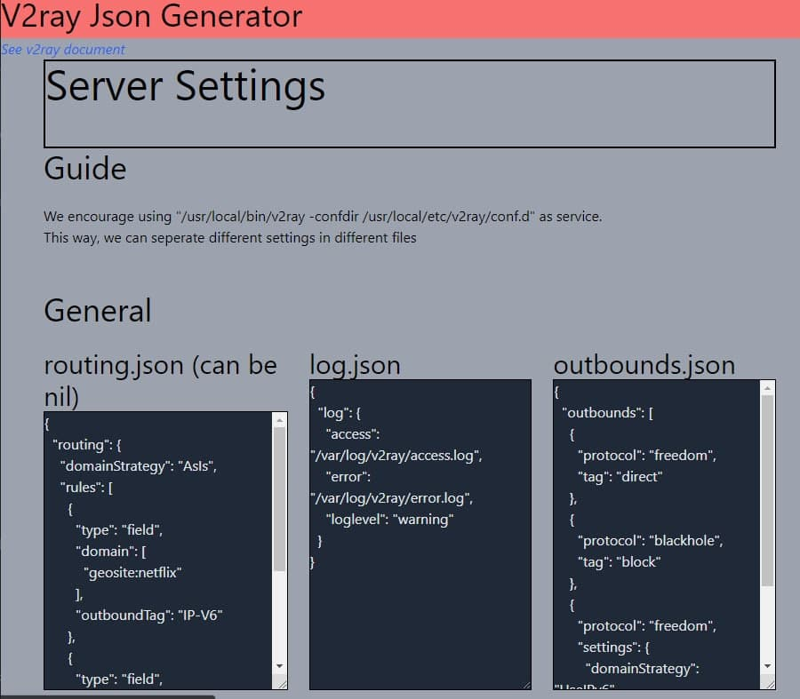
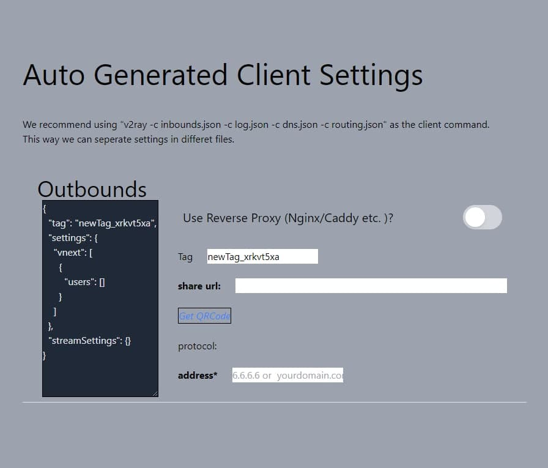

# v2ray_json_generator

 v2ray_json_generator 的web app，可以迅速生成服务端和客户端的配置文件。特点就是一个html文件就搞定，比x-ui轻量很多，适合高级玩法，不受x-ui拘束
 
 使用 tailwind + vue2 技术。
 
 本app优点：
 
 1. 完全本地；
 2. 在右侧输入信息后，左侧json框同步更新，适合学习json配置
 3. 支持生成 QRCode 客户端分享链接，以及对应url

## 本项目使用的协议

开源，但有如下要求必须满足

1. 你觉得本项目好用，你就star本项目
2. star越多我更新越快。具体来说，两次commit之间必须要有一个新star存在，否则我可以拒绝更新。star一直不增长的话，我可能就会删库。


 
 ## 关于完全单html的使用
 
 目前还包含 tailwind和 vue2的 js文件；如果想要单html文件也不难，把链接换成cdn的链接即可，缺点就是加载慢一点，因为并不是完全本地文件了。
 
 具体是
 
 把
```html
<script src="tailwindcss.js"></script>
<script src="vue.js"></script>
```
 
 换成
 
 ```html
<script src="https://cdn.tailwindcss.com"></script>
<script src="https://cdn.jsdelivr.net/npm/vue@2/dist/vue.js"></script>
 ```

 
 
 
 
 
 

## 使用方式

下载本仓库，双击 html文件打开浏览器。

点击、输入，生成想要的json文件后，复制 xxx.json 框里的内容，依照网页里的提示，在服务端创建 对应的 xxx.json 文件，粘贴到里面。

## 当前支持协议

支持 vmess, vless 和 http 协议；
支持 tls 加密方式； 
支持 ws, gRPC 和 tcp(http) stream方式。

## 开发计划

以后会支持更多协议；同时以后会支持导入配置，方便在现有配置上继续修改。

## 与 x-ui等面板的对比

x-ui确实挺方便，但是我是一个高级玩家，我不想让它来替我安装 xray/v2ray等，我要自己安排安装位置、服务配置；
我还要用nginx前置，这些 x-ui都比较难办，不够灵活；

x-ui生成的json文件根本不会给你看，你始终不了解v2ray配置的json文件如何书写，这对于学习的进步是一个阻碍；

本app 一步一步带你编写正确的json文件，不怕漏标点符号，不怕写错。

还有就是，x-ui必须一致开着，留了一个网页后门，容易被攻击，不够隐蔽；

x-ui会自动下载xray版本，如果它下载的是魔改过的版本，那就是有安全风险的。目前应该不会，但是我就是为了安全，才搞得纯本地的web app

更不用说，我可能又揭露了一个 xray的 xtls的重大风险，见：https://github.com/e1732a364fed/xtls-/blob/main/README.md

总之还是转型v2ray吧

## 与其他配置生成器的对比

1. 
https://intmainreturn0.com/v2ray-config-gen/

不仅它是在线的，也许有风险，而且显然它的界面的结构比较糟糕，似乎功能也没有我的强。

还是那句话，我只求安全，自己配置什么的千万不要在线生成，所谓的订阅转换网站也是一个道理。

2.
https://milione.cc/?p=783

这个是windows端的程序，不仅有 编译软件的风险，而且依然功能没我的强

3.
https://github.com/htfy96/v2ray-config-gen

这个和我的类似，不过已经超过6年没有维护了，不支持vless，而且文件太多。本项目的理念就是文件越少越好。
